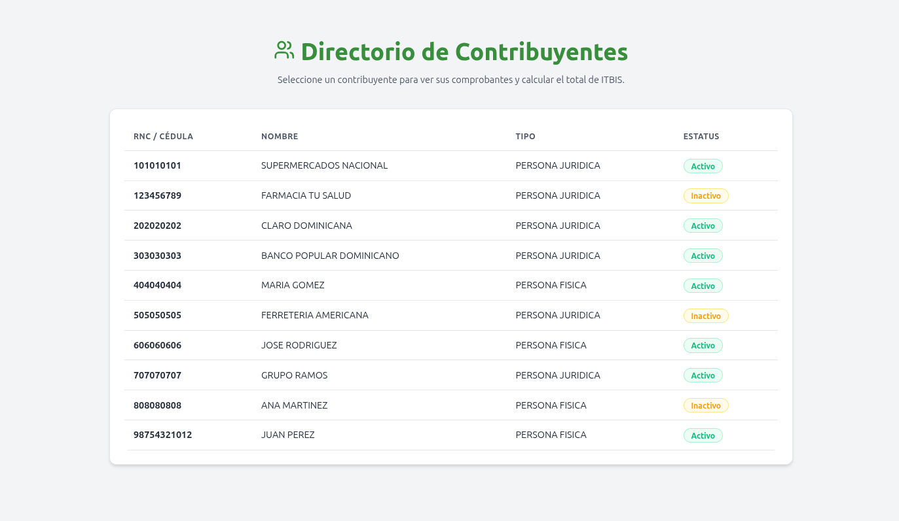
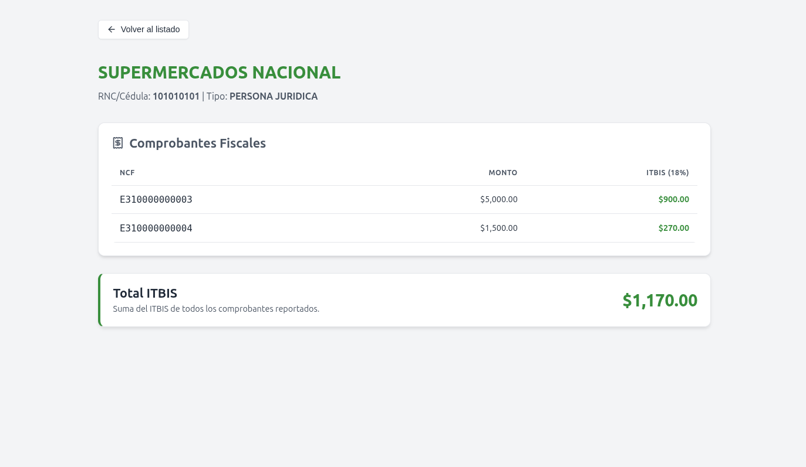

# Sistema de Gestión de Contribuyentes

Este proyecto es una solución integral para la gestión y consulta de **Contribuyentes** y **Comprobantes Fiscales**. Esta solucion se divide en dos partes, una API REST y una interfaz de usuario (frontend), ambas divididas en componentes en contenedores de Docker. 

## 🚀 Arquitectura y Tecnologías

El proyecto sigue una arquitectura limpia (Clean Architecture) dividida en componentes en contenedores de Docker.

### Backend (`/backend`)
- **Framework:** .NET 8 (ASP.NET Core Web API)
- **Arquitectura:** Clean Architecture (`Dgii.Api`, `Dgii.Application`, `Dgii.Domain`, `Dgii.Infrastructure`).
- **Pruebas:** Proyecto `Dgii.Tests` incluido.

### Frontend (`/frontend`)
- **Librería/Framework:** React 19 con TypeScript.
- **Build Tool:** Vite.
- **Servidor Web:** Nginx (para servir los archivos estáticos en producción/Docker).
- **Estilos:** CSS Modules / Vanilla CSS con íconos de Lucide React.

### Base de Datos
- **Motor:** SQL Server 2022 (`mcr.microsoft.com/mssql/server:2022-latest`).

---

## ✨ Funcionalidades (Features)

El sistema cuenta con las siguientes características principales:

1. **Listado de Contribuyentes:** Permite visualizar todos los contribuyentes registrados en el sistema.
2. **Listado de Comprobantes Fiscales:** Visualización general de los comprobantes fiscales generados/recibidos.
3. **Detalles de Contribuyente:** Búsqueda y visualización de la información detallada de un contribuyente en específico utilizando su RNC o Cédula.
4. **Diseño Responsivo:** Interfaz adaptable a diferentes tamaños de pantalla.
5. **Paginación de Resultados:** Navegación optimizada mediante páginas en el listado de contribuyentes, preservando el estado de la página al navegar entre vistas.
---

## 📸 Vista Previa





---

## 🛠️ Cómo ejecutar el proyecto (Localmente)

El proyecto está dockerizado para que sea muy fácil de levantar sin necesidad de instalar dependencias locales (como el SDK de .NET, Node.js o SQL Server). 

### Requisitos Previos
- [Docker](https://docs.docker.com/get-docker/)
- [Docker Compose V2](https://docs.docker.com/compose/install/)

### Pasos para iniciar:

1. **Clonar el repositorio:** Abre tu terminal y ejecuta el siguiente comando para descargar el proyecto en tu máquina local. Luego, entra a la carpeta del proyecto:

```bash
git clone https://github.com/manueledwardopaez/sistema-contribuyentes-dgii.git
cd sistema-contribuyentes-dgii
```

2. **Ejecutar el proyecto:** Levanta la aplicación completa ejecutando el siguiente comando para construir las imágenes y arrancar los contenedores en segundo plano:

```bash
docker compose up -d --build
```

3. **Acceder a los servicios:** Una vez los contenedores estén arriba (la base de datos SQL Server puede tardar un poco la primera vez), podrás acceder a la aplicación desde tu navegador:

- **🌐 Frontend (Aplicación Web):** [http://localhost:3000](http://localhost:3000)
- **📖 Documentación API (Swagger):** [http://localhost:5000/swagger](http://localhost:5000/swagger)
- **⚙️ Backend (API REST - Base):** [http://localhost:5000/api](http://localhost:5000/api)
- **🗄️ Base de Datos:** Puerto `1433` (Credenciales: usuario `SA` / contraseña `Dgii_Password123!`)

### Para detener el proyecto:

```bash
docker compose down
```

